# EverChain — System Architecture

> Complete view of the **EverChain** ecosystem — 5 independent blockchains
> (BitEver / LightningEver / EtherEver / ArbiEver / SolaEver) and every
> supporting service (explorers, wallets, bridge helper). All **26 public repos**
> of `makewalletfirst` are mapped as clickable nodes.

```mermaid
%%{ init: { 'theme': 'dark', 'flowchart': { 'curve': 'basis', 'nodeSpacing': 38, 'rankSpacing': 56 } } }%%
flowchart TB
  USER(("사용자")):::user
  PORTAL["EverChain Portal<br/>ever-chain.xyz"]:::portal
  USER --> PORTAL
  subgraph BTC_FAMILY["Bitcoin family"]
    direction TB
    subgraph BTC_L1["BitEver L1 BEC - Bitcoin Core v30.2 fork at 478558"]
      direction TB
      BE[("BitEver<br/>chain")]:::cpp
      BE_ELEC["BitEver-electrum<br/>Win + Android wallet"]:::py
      BE_MEMP["BitEver-mempool.space<br/>mempool dashboard"]:::docker
      BE_ESPL["BitEver-esplora<br/>Esplora explorer"]:::js
      BE_RPCX["BitEver-RPCexplorer<br/>RPC explorer"]:::js
      BE_ELEC -.uses RPC.-> BE
      BE_MEMP -.tails blocks.-> BE
      BE_ESPL -.indexes.-> BE
      BE_RPCX -.queries.-> BE
    end
    subgraph LN_L2["LightningEver L2 ever - single-node LSP"]
      direction TB
      LN_LSP[("LightningEver<br/>Eclair LSP fork")]:::scala
      LN_PLUG["LightningEver-eclair-plugin<br/>channel-funding 50M sat liquidity"]:::scala
      LN_KMP["LightningEver-eclair-kmp<br/>lightning-kmp fork"]:::kotlin
      LN_PHX["LightningEver-phoenix<br/>Phoenix Android app"]:::kotlin
      LN_EXPL["LightningEver-Explorer<br/>read-only 20s cache proxy"]:::js
      LN_RTL["LightningEver-RTL<br/>operator console fork"]:::ts
      LN_LSP --- LN_PLUG
      LN_LSP -.serves.-> LN_EXPL
      LN_LSP -.admin via.-> LN_RTL
      LN_KMP --- LN_PHX
      LN_PHX -.on-the-fly channel.-> LN_LSP
    end
    LN_LSP ==L1 swap-in auto channel==> BE
  end
  subgraph ETH_FAMILY["Ethereum family"]
    direction TB
    subgraph ETH_L1["EtherEver L1 ETE - Core-Geth PoW fork at 1919999"]
      direction TB
      EE[("EtherEver<br/>Go chain")]:::go
      EE_MM["EtherEver-Metamask<br/>MetaMask Mobile fork<br/>patch-package incoming-tx fix"]:::ts
      EE_BS["EtherEver-BlockScout<br/>Solc + WalletConnect"]:::elixir
      EE_MM -.RPC.-> EE
      EE_BS -.indexes.-> EE
    end
    subgraph ARB_L2["ArbiEver L2 ETE - Nitro AnyTrust"]
      direction TB
      AE[("ArbiEver<br/>Solidity chain<br/>Nitro stack")]:::sol
      AE_MM["ArbiEver-Metamask<br/>MetaMask Mobile fork<br/>4-fold safety net"]:::ts
      AE_BS["ArbiEver-BlockScout<br/>Solc + WalletConnect"]:::elixir
      AE_EXPL["ArbiEver-Explorer<br/>Alethio Lite"]:::shell
      AE_MM -.RPC.-> AE
      AE_BS -.indexes.-> AE
      AE_EXPL -.indexes.-> AE
    end
    AE ==Inbox / Outbox - Brotli batches==> EE
  end
  BRIDGE["EverChain-Bridge-Helper<br/>bridge.ever-chain.xyz<br/>3-tab dApp - L1-L2 deposit / L2-L1 withdraw / L1 execute"]:::html
  BRIDGE -.L1 tx.-> EE
  BRIDGE -.L2 tx.-> AE
  subgraph SOL_FAMILY["Solana family - independent"]
    direction TB
    subgraph SOL_L1["SolaEver L1 SLE - Agave v4.0 fork + Metaplex 8 program mirror"]
      direction TB
      SE[("SolaEver<br/>Rust validator<br/>u128 overflow patch")]:::rust
      SE_EXPL["SolaEver-Explorer<br/>Next.js fork<br/>SOLAEVER EXPLORER logo"]:::ts
      SE_WALL["SolaEver-wallet<br/>RN - Metaplex metadata auto-fetch"]:::ts
      SE_EXT["SolaEver-wallet-extension<br/>Chrome extension"]:::ts
      SE_EXPL -.RPC.-> SE
      SE_WALL -.RPC + Metaplex PDA.-> SE
      SE_EXT -.RPC.-> SE
    end
  end
  PORTAL ==> BE
  PORTAL ==> LN_LSP
  PORTAL ==> EE
  PORTAL ==> AE
  PORTAL ==> SE
  PORTAL ==> BRIDGE
  subgraph META["Profile / Assets"]
    direction LR
    PROF["makewalletfirst<br/>profile README"]:::doc
    STATS["github-readme-stats<br/>fork - stats badge"]:::doc
    IMG["image<br/>shared brand assets"]:::doc
  end
  classDef user fill:#1e293b,stroke:#38bdf8,color:#e0f2fe,stroke-width:2px
  classDef portal fill:#312e81,stroke:#a5b4fc,color:#e0e7ff,stroke-width:2px
  classDef cpp fill:#00427e,stroke:#5b8def,color:#fff
  classDef rust fill:#7c2d12,stroke:#fb923c,color:#fff
  classDef go fill:#0f4c5c,stroke:#0ea5e9,color:#fff
  classDef sol fill:#525252,stroke:#a3a3a3,color:#fff
  classDef py fill:#1e3a8a,stroke:#60a5fa,color:#fff
  classDef ts fill:#1e3a8a,stroke:#818cf8,color:#fff
  classDef js fill:#854d0e,stroke:#facc15,color:#fff
  classDef elixir fill:#5b21b6,stroke:#c084fc,color:#fff
  classDef scala fill:#7f1d1d,stroke:#f87171,color:#fff
  classDef kotlin fill:#5b21b6,stroke:#a78bfa,color:#fff
  classDef docker fill:#1e40af,stroke:#3b82f6,color:#fff
  classDef shell fill:#374151,stroke:#9ca3af,color:#fff
  classDef html fill:#9d174d,stroke:#f472b6,color:#fff
  classDef doc fill:#1f2937,stroke:#6b7280,color:#d1d5db
  click BE "https://github.com/makewalletfirst/BitEver" _blank
  click BE_ELEC "https://github.com/makewalletfirst/BitEver-electrum" _blank
  click BE_MEMP "https://github.com/makewalletfirst/BitEver-mempool.space" _blank
  click BE_ESPL "https://github.com/makewalletfirst/BitEver-esplora" _blank
  click BE_RPCX "https://github.com/makewalletfirst/BitEver-RPCexplorer" _blank
  click LN_LSP "https://github.com/makewalletfirst/LightningEver" _blank
  click LN_PLUG "https://github.com/makewalletfirst/LightningEver-eclair-plugin" _blank
  click LN_KMP "https://github.com/makewalletfirst/LightningEver-eclair-kmp" _blank
  click LN_PHX "https://github.com/makewalletfirst/LightningEver-phoenix" _blank
  click LN_EXPL "https://github.com/makewalletfirst/LightningEver-Explorer" _blank
  click LN_RTL "https://github.com/makewalletfirst/LightningEver-RTL" _blank
  click EE "https://github.com/makewalletfirst/EtherEver" _blank
  click EE_MM "https://github.com/makewalletfirst/EtherEver-Metamask" _blank
  click EE_BS "https://github.com/makewalletfirst/EtherEver-BlockScout" _blank
  click AE "https://github.com/makewalletfirst/ArbiEver" _blank
  click AE_MM "https://github.com/makewalletfirst/ArbiEver-Metamask" _blank
  click AE_BS "https://github.com/makewalletfirst/ArbiEver-BlockScout" _blank
  click AE_EXPL "https://github.com/makewalletfirst/ArbiEver-Explorer" _blank
  click BRIDGE "https://github.com/makewalletfirst/EverChain-Bridge-Helper" _blank
  click SE "https://github.com/makewalletfirst/SolaEver4" _blank
  click SE_EXPL "https://github.com/makewalletfirst/SolaEver-Explorer" _blank
  click SE_WALL "https://github.com/makewalletfirst/SolaEver-wallet" _blank
  click SE_EXT "https://github.com/makewalletfirst/SolaEver-wallet-extension" _blank
  click PROF "https://github.com/makewalletfirst/makewalletfirst" _blank
  click STATS "https://github.com/makewalletfirst/github-readme-stats" _blank
  click IMG "https://github.com/makewalletfirst/image" _blank
```

---

## Legend

- **Solid arrow `==>`** — user-facing flow (Portal → chain, L2 → L1 anchoring)
- **Dotted `-.->`** — infrastructure dependency (RPC / index / proxy)
- **Color** — primary language / stack of each repo
- **Click any node** — opens the corresponding GitHub repository in a new tab

## Stats

- **26 public repos** across 13 languages (C++, Rust, Go, Solidity, Python, TypeScript, JavaScript, Elixir, Scala, Kotlin, Dockerfile, Shell, HTML)
- **3 L1 chains** — BitEver (PoW), EtherEver (PoW), SolaEver (PoS)
- **2 L2 chains** — LightningEver on BitEver, ArbiEver on EtherEver
- **1 cross-L2 bridge dApp** — EverChain-Bridge-Helper

## Single-source

This diagram is the authoritative architecture overview. It is also embedded
(collapsible) in the [profile README](https://github.com/makewalletfirst/makewalletfirst).
